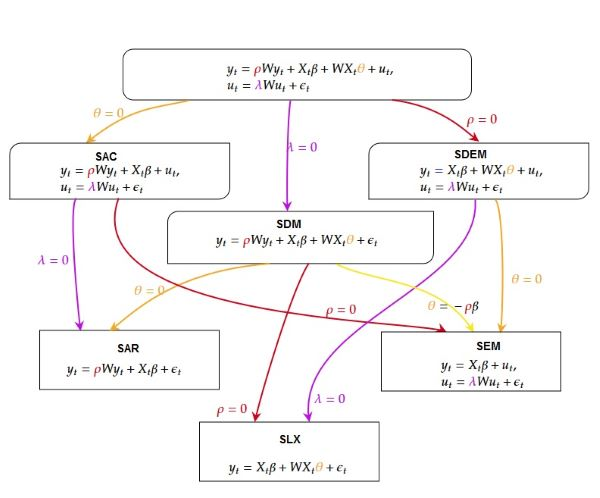

```{r setup, include = FALSE}
knitr::opts_chunk$set(
  collapse = TRUE,
  comment = "#>"
)
```

```{r }
library(SDPDmod)
```

This vignette gives a few examples on how to use the `blmpSDPD` and `SDPDmod` functions from the `SDPDmod` package.

# Introduction

The general spatial static panel model takes the form:

```{=tex}
\begin{equation}
\begin{aligned}
y_{t}&=\rho W y_{t} + X_{t} \beta + W X_{t} \theta + u_{t},  \\
u_{t} &=\lambda W  u_{t}+\epsilon_{t} 
\end{aligned} \label{eq:mod1}\tag{1}
\end{equation}
```
where the $N \times 1$ vector $y_{t}$ is the dependent variable, $X_{t}$ is a $N \times k$ matrix of $k$ explanatory variables and $W$ is a spatial weights matrix. $N$ represents the number of units and $t=1,...,T$ are the time points. The spatial lags for the vector of covariates is denoted with $WX_t$. Spatial interaction in the error term $u_{it}$ is included with the $\lambda$ coefficient and it is assumed that $\epsilon_t$ is independently and identically distributed error term for all $t$ with zero mean and variance $\sigma^2$. $\rho$ is the spatial autoregressive coefficient, $\lambda$ the spatial autocorrelation coefficient, $\beta$ is a vector of response parameters for the covariates.



<font size="1"> *Note*: SAC - spatial autoregressive combined, SDM - spatial Durbin model, SDEM - spatial Durbin error model, SAR - spatial autogregressive model (or Spatial lag model), SEM - spatial error model, SLX - spatially lagged X model.\
</font>

However, model ([1](#eq:mod1)) suffers from identification problems [@elhorst2010]. Figure [1](#fig:fig1) shows the identifiable models, which are derived by imposing some restrictions on model ([1](#eq:mod1)). If all spatial coefficients are zero ($\rho = \theta = \lambda = 0$), then the corresponding model will be the ordinary least-squares model (OLS). If in each of the models in figure ([1](#fig:fig1)) $\eta W y_{t-1} +\tau y_{t-1}$ is added, we get the corresponding dynamic panel data models. $y_{(t-1)}$ denotes the time lag of the dependent variable and $Wy_{(t-1)}$ is the time-space lag. $\tau$ and $\eta$ are the response parameters for the lagged variable.

@lesage2007bayesian and @lesage2014spatial suggest a Bayesian approach for selecting an appropriate model. The calculation of the posterior probabilities for 6 models (SAR, SEM, SDM, SDEM, SLX, OLS) is possible with the function `blmpSDPD`.

The function `SDPMm` provides estimation of a SAR and SDM model with the Lee-Yu transformation approach (@yu2008quasi, @lee2010estimation, @lee2010aspatial).

# Data

The Cigar data set (@baltagi1992cigarette) from the `plm` package (@croissant2008panel) will be used for describing the use of the `blmpSDPD` and `SDPMm` functions. It contains panel data of cigarette consumption in 46 states in the USA over the period from 1963 to 1992. The binary contiguity matrix of the 46 states is included in the `SDPMmod` package.

```{r data, eval=TRUE, echo=T, warning=FALSE, message=FALSE}
data("Cigar",package = "plm")
head(Cigar)
data1<- Cigar
data1$logc<-log(data1$sales)
data1$logp<-log(data1$price/data1$cpi)
data1$logy<-log(data1$ndi/data1$cpi)
data1$lpm<-log(data1$pimin/data1$cpi)

data("usa46",package="SDPDmod") ## binary contiguity matrix of 46 USA states
str(usa46)
W <- rownor(usa46) ## row-normalization
isrownor(W) ## check if W is row-normalized
```

# Bayesian posterior probabilities
## Static panel model with spatial fixed effects

If the option `dynamic` is not set, then the default model is static.
For  spatial fixed effects `effect` should be set to "individual".
```{r m1, eval=TRUE, echo=T, warning=FALSE, message=FALSE}
res1<-blmpSDPD(formula = logc ~ logp+logy, data = data1, W = W,
               index = c("state","year"),
               model = list("ols","sar","sdm","sem","sdem","slx"), 
               effect = "individual")
res1
```

## Static panel model with time fixed effects
```{r m2, eval=TRUE, echo=T, warning=FALSE, message=FALSE}
res2<-blmpSDPD(formula = logc ~ logp+logy, data = data1, W = W,
               index = c("state","year"),
               model = list("ols","sar","sdm","sem","sdem","slx"), 
               effect = "time")
```

## Static panel model with both spatial and time fixed effects for 4 models (SAR, SDM, SEM, SDEM)

The default prior is uniform. With `prior="beta"` the beta prior is used.
```{r m3, eval=TRUE, echo=T, warning=FALSE, message=FALSE}
res3<-blmpSDPD(formula = logc ~ logp+logy, data = data1, W = W,
               index = c("state","year"),
               model = list("sar","sdm","sem","sdem"), 
               effect = "twoways",
               prior = "beta")
```

## Dynamic panel model with both spatial and time fixed effects with uniform prior
```{r m4, eval=TRUE, echo=T, warning=FALSE, message=FALSE}
res4<-blmpSDPD(formula = logc ~ logp+logy, data = data1, W = W,
               index = c("state","year"),
               model = list("sar","sdm","sem","sdem","slx"), 
               effect = "twoways",
               ldet = "mc", ## log-determinant calculated with mcmc procedure
               dynamic = TRUE,
               prior = "uniform")
```

## Dynamic panel model with both spatial fixed effects with beta prior, where the lagged dependent variable is included in the data

```{r m5, eval=TRUE, echo=T, warning=FALSE, message=FALSE}
d2 <- plm::pdata.frame(data1, index=c('state', 'year'))
d2$llogc<-plm::lag(d2$logc) ## add lagged variable
data2<-d2[which(!is.na(d2$llogc)),]
rownames(data2)<-1:nrow(data2)
kk<-which(colnames(data2)=="llogc"); kk

res5<-blmpSDPD(formula = logc ~ logp+logy, data = data2, W = W,
               index = c("state","year"),
               model = list("sar","sdm","sem","sdem"), 
               effect = "individual",
               ldet = "full",
               dynamic = TRUE,
               tlaginfo = list(ind=kk),
               prior = "beta")
```


# Spatial (dynamic) panel data modeling

## Static spatial lag model with spatial fixed effects
```{r mod1, eval=TRUE, echo=T, warning=FALSE, message=FALSE}
mod1<-SDPDm(formula = logc ~ logp+logy, data = data1, W = W,
            index = c("state","year"),
            model = "sar", 
            effect = "individual")
summary(mod1)
```

## Dynamic spatial lag model with spatial fixed effects 

`dynamic` should be set to TRUE as well as the option `stl` in  `tlaginfo` for inclusion of time lag. For space-time lag effect the option `stl` in `tlaginfo` should also be set to TRUE
```{r , eval=TRUE, echo=T, warning=FALSE, message=FALSE}
mod2<-SDPDm(formula = logc ~ logp+logy, data = data1, W = W,
            index = c("state","year"),
            model = "sar", 
            effect = "individual",
            dynamic = T,
            tlaginfo = list(ind = NULL, tl = T, stl = T))
summary(mod2)
```

## Dynamic spatial model with spatial fixed effects (with Lee-Yu transformation)
```{r , eval=TRUE, echo=T, warning=FALSE, message=FALSE}
mod3<-SDPDm(formula = logc ~ logp+logy, data = data1, W = W,
            index = c("state","year"),
            model = "sar", 
            effect = "individual",
            LYtrans = T,
            dynamic = T,
            tlaginfo = list(ind = NULL, tl = T, stl = T))
summary(mod3)
```

```{r , eval=TRUE, echo=T, warning=FALSE, message=FALSE}
mod4<-SDPDm(formula = logc ~ logp+logy, data = data2, W = W,
            index = c("state","year"),
            model = "sar", 
            effect = "individual",
            LYtrans = T,
            dynamic = T,
            tlaginfo = list(ind = kk, tl = T, stl = F))
summary(mod4)
```

## Dynamic spatial Durbin model with spatial and time fixed effects (with Lee-Yu transformation)
```{r , eval=TRUE, echo=T, warning=FALSE, message=FALSE}
mod5<-SDPDm(formula = logc ~ logp+logy, data = data1, W = W,
            index = c("state","year"),
            model = "sdm", 
            effect = "twoways",
            LYtrans = T,
            dynamic = T,
            tlaginfo = list(ind = NULL, tl = T, stl = T))
summary(mod5)
```

# Calculating impacts.
```{r, eval=TRUE, echo=T, warning=FALSE, message=FALSE }
imp  <- impactsSDPDm(mod5)
imp
```

# References
